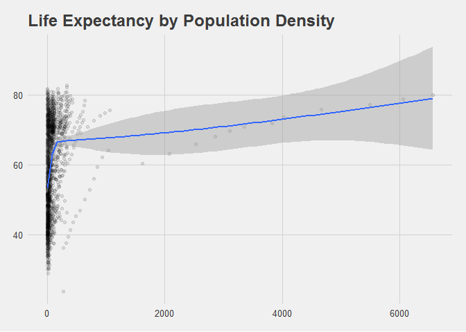
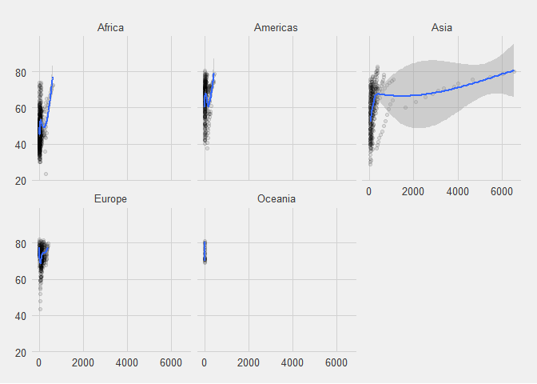

Effect of Population Density on Life Expectancy
================
Gustavo Arruda Franco
2020-12-03

## Settings

``` r
knitr::opts_chunk$set(echo = TRUE, warnings = FALSE, message = FALSE)
library(gapminder)
library(dplyr)
```

    ## 
    ## Attaching package: 'dplyr'

    ## The following objects are masked from 'package:stats':
    ## 
    ##     filter, lag

    ## The following objects are masked from 'package:base':
    ## 
    ##     intersect, setdiff, setequal, union

``` r
library(geonames)
```

    ## Warning: package 'geonames' was built under R version 4.0.3

``` r
library(countrycode)
```

    ## Warning: package 'countrycode' was built under R version 4.0.3

``` r
library(ggplot2)
library(ggthemes)
```

    ## Warning: package 'ggthemes' was built under R version 4.0.3

``` r
theme_set(theme_fivethirtyeight())
```

## Code

The following code retrieves the relevant dataframes from a R library
and an API, then tidies and joins them.

``` r
gapminder <- data.frame(gapminder)
key <- getOption("geonamesUsername")
countryInfo <- data.frame(GNcountryInfo())
countryJoin <- countrycode(countryInfo[, 13], origin = 'iso2c', destination = 'country.name')
```

    ## Warning in countrycode(countryInfo[, 13], origin = "iso2c", destination = "country.name"): Some values were not matched unambiguously: XK

``` r
countryInfo <- mutate(countryInfo, country = countryJoin)
gapminder_density <- left_join(gapminder, countryInfo, by = "country") %>%
  mutate(popDensity = pop / as.numeric(areaInSqKm))
```

## Analysis

``` r
ggplot(gapminder_density, aes(x = popDensity, y = lifeExp)) +
  geom_jitter(alpha = 0.1) +
  geom_smooth() +
  labs(x = "Population density (inhabitants per Sq Km)", y = "Average life expectancy", title = "Life Expectancy by Population Density")
```

    ## Warning: Removed 192 rows containing non-finite values (stat_smooth).

    ## Warning: Removed 192 rows containing missing values (geom_point).

<!-- -->

``` r
ggplot(gapminder_density, aes(x = popDensity, y = lifeExp)) +
  geom_jitter(alpha = 0.1) +
  facet_wrap(~ continent.x) +
  geom_smooth()
```

    ## Warning: Removed 192 rows containing non-finite values (stat_smooth).
    
    ## Warning: Removed 192 rows containing missing values (geom_point).

<!-- -->

``` r
gapminder_density_mod <- lm(lifeExp ~ popDensity, data = gapminder_density)
summary(gapminder_density_mod)
```

    ## 
    ## Call:
    ## lm(formula = lifeExp ~ popDensity, data = gapminder_density)
    ## 
    ## Residuals:
    ##     Min      1Q  Median      3Q     Max 
    ## -36.823 -11.102   1.172  11.459  23.021 
    ## 
    ## Coefficients:
    ##              Estimate Std. Error t value Pr(>|t|)    
    ## (Intercept) 58.717842   0.345941 169.734  < 2e-16 ***
    ## popDensity   0.006155   0.000872   7.059 2.55e-12 ***
    ## ---
    ## Signif. codes:  0 '***' 0.001 '**' 0.01 '*' 0.05 '.' 0.1 ' ' 1
    ## 
    ## Residual standard error: 12.88 on 1510 degrees of freedom
    ##   (192 observations deleted due to missingness)
    ## Multiple R-squared:  0.03194,    Adjusted R-squared:  0.0313 
    ## F-statistic: 49.82 on 1 and 1510 DF,  p-value: 2.554e-12

From the “Life Expectancy by Population Density” chart and the linear
regression model coefficients, we can see there is a small but strong
correlation between population density and life expectancy. However,
most of the observations are clustered vertically at the beginning of
the low density scale. When we probe deeper by faceting the observations
by continent, we see that there is a sharp increase, a valley, then
another sharp increase in Europe, Americas and Africa. Asia looks
different, with no valleys and a much longer tail of increasing
population density. Oceania shows no visible correlation.

## Session info

``` r
devtools::session_info()
```

    ## - Session info ---------------------------------------------------------------
    ##  setting  value                       
    ##  version  R version 4.0.2 (2020-06-22)
    ##  os       Windows 8.1 x64             
    ##  system   x86_64, mingw32             
    ##  ui       RTerm                       
    ##  language (EN)                        
    ##  collate  English_United States.1252  
    ##  ctype    English_United States.1252  
    ##  tz       America/Chicago             
    ##  date     2020-12-03                  
    ## 
    ## - Packages -------------------------------------------------------------------
    ##  package     * version date       lib source        
    ##  assertthat    0.2.1   2019-03-21 [1] CRAN (R 4.0.2)
    ##  callr         3.5.1   2020-10-13 [1] CRAN (R 4.0.3)
    ##  cli           2.0.2   2020-02-28 [1] CRAN (R 4.0.2)
    ##  colorspace    1.4-1   2019-03-18 [1] CRAN (R 4.0.2)
    ##  countrycode * 1.2.0   2020-05-22 [1] CRAN (R 4.0.3)
    ##  crayon        1.3.4   2017-09-16 [1] CRAN (R 4.0.2)
    ##  desc          1.2.0   2018-05-01 [1] CRAN (R 4.0.2)
    ##  devtools      2.3.2   2020-09-18 [1] CRAN (R 4.0.3)
    ##  digest        0.6.25  2020-02-23 [1] CRAN (R 4.0.2)
    ##  dplyr       * 1.0.2   2020-08-18 [1] CRAN (R 4.0.2)
    ##  ellipsis      0.3.1   2020-05-15 [1] CRAN (R 4.0.2)
    ##  evaluate      0.14    2019-05-28 [1] CRAN (R 4.0.2)
    ##  fansi         0.4.1   2020-01-08 [1] CRAN (R 4.0.2)
    ##  farver        2.0.3   2020-01-16 [1] CRAN (R 4.0.2)
    ##  fs            1.5.0   2020-07-31 [1] CRAN (R 4.0.2)
    ##  gapminder   * 0.3.0   2017-10-31 [1] CRAN (R 4.0.2)
    ##  generics      0.1.0   2020-10-31 [1] CRAN (R 4.0.3)
    ##  geonames    * 0.999   2019-02-19 [1] CRAN (R 4.0.3)
    ##  ggplot2     * 3.3.2   2020-06-19 [1] CRAN (R 4.0.2)
    ##  ggthemes    * 4.2.0   2019-05-13 [1] CRAN (R 4.0.3)
    ##  glue          1.4.2   2020-08-27 [1] CRAN (R 4.0.2)
    ##  gtable        0.3.0   2019-03-25 [1] CRAN (R 4.0.2)
    ##  htmltools     0.5.0   2020-06-16 [1] CRAN (R 4.0.2)
    ##  knitr         1.30    2020-09-22 [1] CRAN (R 4.0.2)
    ##  labeling      0.3     2014-08-23 [1] CRAN (R 4.0.0)
    ##  lattice       0.20-41 2020-04-02 [2] CRAN (R 4.0.2)
    ##  lifecycle     0.2.0   2020-03-06 [1] CRAN (R 4.0.2)
    ##  lubridate     1.7.9   2020-06-08 [1] CRAN (R 4.0.2)
    ##  magrittr      1.5     2014-11-22 [1] CRAN (R 4.0.2)
    ##  Matrix        1.2-18  2019-11-27 [2] CRAN (R 4.0.2)
    ##  memoise       1.1.0   2017-04-21 [1] CRAN (R 4.0.2)
    ##  mgcv          1.8-31  2019-11-09 [2] CRAN (R 4.0.2)
    ##  munsell       0.5.0   2018-06-12 [1] CRAN (R 4.0.2)
    ##  nlme          3.1-148 2020-05-24 [2] CRAN (R 4.0.2)
    ##  pillar        1.4.6   2020-07-10 [1] CRAN (R 4.0.2)
    ##  pkgbuild      1.1.0   2020-07-13 [1] CRAN (R 4.0.2)
    ##  pkgconfig     2.0.3   2019-09-22 [1] CRAN (R 4.0.2)
    ##  pkgload       1.1.0   2020-05-29 [1] CRAN (R 4.0.2)
    ##  prettyunits   1.1.1   2020-01-24 [1] CRAN (R 4.0.2)
    ##  processx      3.4.4   2020-09-03 [1] CRAN (R 4.0.2)
    ##  ps            1.3.4   2020-08-11 [1] CRAN (R 4.0.2)
    ##  purrr         0.3.4   2020-04-17 [1] CRAN (R 4.0.2)
    ##  R6            2.4.1   2019-11-12 [1] CRAN (R 4.0.2)
    ##  Rcpp          1.0.5   2020-07-06 [1] CRAN (R 4.0.2)
    ##  remotes       2.2.0   2020-07-21 [1] CRAN (R 4.0.2)
    ##  rjson         0.2.20  2018-06-08 [1] CRAN (R 4.0.3)
    ##  rlang         0.4.7   2020-07-09 [1] CRAN (R 4.0.2)
    ##  rmarkdown     2.5     2020-10-21 [1] CRAN (R 4.0.3)
    ##  rprojroot     2.0.2   2020-11-15 [1] CRAN (R 4.0.3)
    ##  scales        1.1.1   2020-05-11 [1] CRAN (R 4.0.2)
    ##  sessioninfo   1.1.1   2018-11-05 [1] CRAN (R 4.0.2)
    ##  stringi       1.5.3   2020-09-09 [1] CRAN (R 4.0.2)
    ##  stringr       1.4.0   2019-02-10 [1] CRAN (R 4.0.2)
    ##  testthat      2.3.2   2020-03-02 [1] CRAN (R 4.0.2)
    ##  tibble        3.0.3   2020-07-10 [1] CRAN (R 4.0.2)
    ##  tidyselect    1.1.0   2020-05-11 [1] CRAN (R 4.0.2)
    ##  usethis       1.6.3   2020-09-17 [1] CRAN (R 4.0.2)
    ##  vctrs         0.3.4   2020-08-29 [1] CRAN (R 4.0.2)
    ##  withr         2.3.0   2020-09-22 [1] CRAN (R 4.0.2)
    ##  xfun          0.17    2020-09-09 [1] CRAN (R 4.0.2)
    ##  yaml          2.2.1   2020-02-01 [1] CRAN (R 4.0.3)
    ## 
    ## [1] C:/Users/Gustavo/OneDrive - The University of Chicago/Documents/R/win-library/4.0
    ## [2] C:/Program Files/R/R-4.0.2/library
