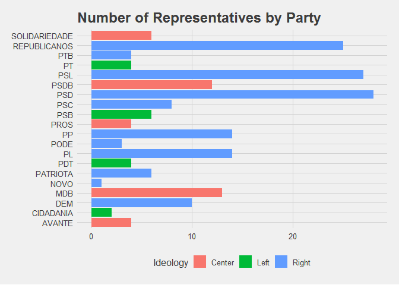
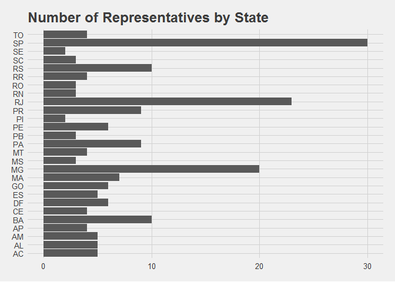
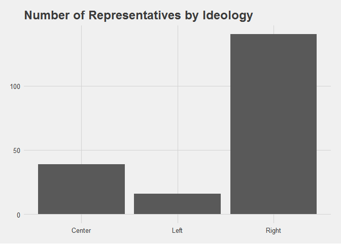

Evangelical Front in the Brazilian Congress
================
Gustavo Arruda
2020-12-03

## Code

The following code extracts a table from the Brazilian House of
Representatives website. The table contains information of all the
representatives that officially participate in the Congressional
Evangelical Front. Then, the code cleans and tidies the aforementioned
table.

It also reads a dataframe I created based on this
[article](https://congressoemfoco.uol.com.br/legislativo/direita-cresce-e-engole-o-centro-no-congresso-mais-fragmentado-da-historia/),
cleans it and joins it to the former one. The dataframe contains the
ideological inclination of each Brazilian party.

``` r
congress <- read_html("https://www.camara.leg.br/internet/deputado/frenteDetalhe.asp?id=54010") %>%
  html_table(fill = TRUE)

bancada_evangelica <- congress[[1]][-1,] %>%
  head(-1)
Partidos_Ideologias_TIDY <- read_csv("Partidos & Ideologias_TIDY.csv")
Ideologia_key <- c(esquerda = "Left", centro = "Center", direita = "Right")
Partidos_Ideologias_TIDY <- mutate(Partidos_Ideologias_TIDY, Ideologia = ifelse(is.na(Ideologia), "esquerda", Ideologia)) %>%
    rename(Partido = Nome) %>%
  mutate(Ideologia = recode(Ideologia, 
                            !!!Ideologia_key),
         Partido = toupper(Partido)) %>%
  rename(Ideology = Ideologia)

bancada_ideology <- left_join(bancada_evangelica, Partidos_Ideologias_TIDY)
```

## Analysis

<!-- --><!-- --><!-- -->

The Evangelical Front is a formal multi-partisan and
multi-denominational association in the Brazilian Congress. From the
graphs, it is clear that the Brazilian Evangelical representatives are
largely associated with right-wing parties. Most of the highly
represented parties are associated with the center and center-right,
known more for physiological inclinations than for clearer ideological
alignment in their policies. REPUBLICANOS, PSD, PP, PL, MDB are all part
of that group. REPUBLICANOS is a special case, because the party was
also founded by Neo-Pentecostal leadership of the second-largest
denomination in Brazil (IURD). PSL was a former physiological
center-right turned to a extreme right-wing party during Bolsonaro’s
2018 campaign.

In terms of state representation, the graph mostly follows the most
populous states. A interesting outlier is the state of Para (PA), which
has much more Evangelical representatives than similarly populated
states (SC, PE, CE). That might be because of the huge influence the
Assemblies of God has in that state, since that’s where their first
missionaries took root. The Assemblies of God is the largest
denomination in Brazil.
